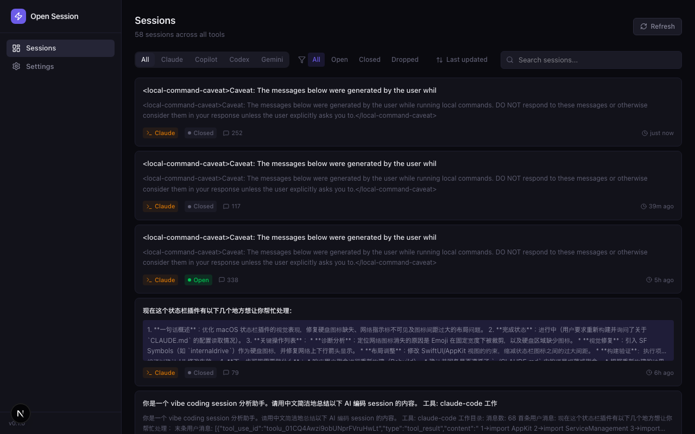
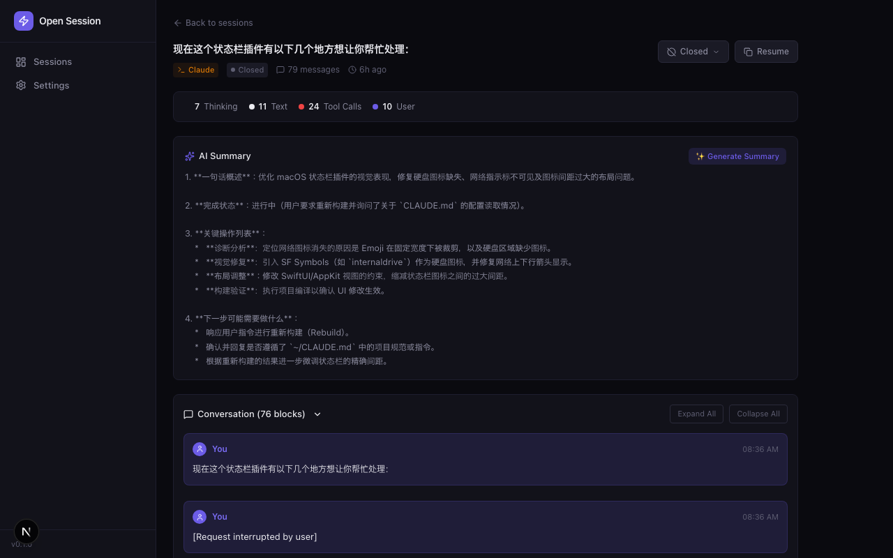
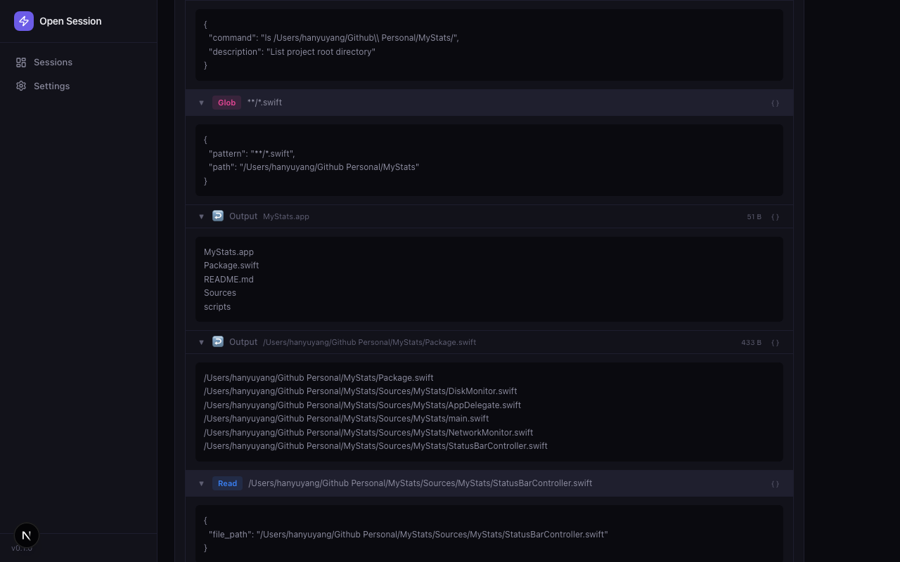
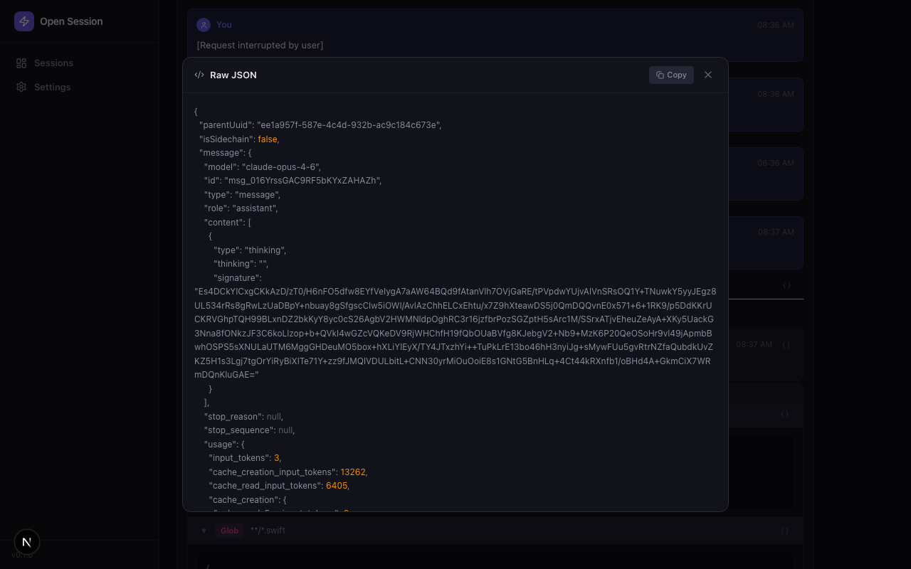

[English](README.md)

# Open Session

统一的仪表板，用于浏览、管理和检查你在 Claude Code、Codex CLI、Copilot CLI 和 Gemini CLI 中的 AI 编码会话记录。

如果你用多个 AI 工具进行 vibe coding，会话历史会以不同格式散落在各个隐藏目录中。Open Session 读取所有这些数据，统一格式，让你在一个地方搜索、筛选、回顾，真正弄清楚 AI Agent 到底做了什么。



## 功能

### 多工具会话聚合

自动发现并解析以下工具的会话：

| 工具 | 数据路径 | 格式 |
|------|----------|------|
| Claude Code | `~/.claude/projects/*/` | JSONL |
| Codex CLI | `~/.codex/sessions/` | JSONL |
| Copilot CLI | `~/.copilot/session-state/` | JSONL |
| Gemini CLI | `~/.gemini/` | JSON / Protobuf |

### 深度 Agent 过程检查

对于 Claude Code 会话，Agent 工作的每一步都完全可见：

- **思考块** — Agent 的推理过程（如可用）。旧版 Claude Code (< 2.1.81) 存储完整思考内容；新版按 Anthropic 政策不再保存。
- **工具调用** — 按工具类型颜色编码（Read、Edit、Bash、Agent、Grep 等），可展开查看参数和语法高亮 JSON。
- **工具结果** — 可折叠的输出，带成功/错误指示和大小显示。
- **并行调用检测** — 自动检测并标记 Agent 同时运行多个工具的情况。
- **Raw JSON 检查器** — 点击任意块上的 `{ }` 查看原始 JSONL 条目。





### 会话管理

- **状态** — 从列表或详情页将会话标记为 `Open`、`Closed` 或 `Dropped`。
- **搜索和筛选** — 按工具、状态或文本搜索。
- **排序** — 按最后更新时间或创建时间排序。
- **AI 摘要** — 使用本地 Claude Code、Codex 或 Gemini CLI 生成会话摘要。
- **恢复会话** — 一键复制恢复命令，从上次中断处继续。

## 快速开始

**前提条件：** Node.js >= 18，以及至少安装了一个有现有会话记录的 AI 编码工具。

```bash
git clone https://github.com/Humsweet/open-session.git
cd open-session
npm install
npm run dev
```

在浏览器中打开 [http://localhost:3000](http://localhost:3000)，会话将被自动发现。

### 生产部署

```bash
npm run build
npm start
```

## 工作原理

```
~/.claude/projects/*/    ─┐
~/.codex/sessions/        ├──▶  解析器  ──▶  SessionMessage[]  ──▶  Next.js 仪表板
~/.copilot/session-state/ ┤
~/.gemini/               ─┘
                                                    │
                                             SQLite 数据库
                                       (~/.open-session/data.db)
                                    状态、摘要、自定义标题
```

1. **扫描** — 每次请求时，解析器扫描文件系统中的会话文件。
2. **解析** — 每个工具的解析器将其格式统一为 `SessionMessage[]`。Claude 解析器提取富内容块（thinking、tool_use、tool_result）。
3. **合并** — 会话状态持久化到本地 SQLite 数据库并与解析数据合并。
4. **渲染** — React 用专门的组件渲染每种块类型。

## 技术栈

| 层级 | 技术 |
|------|------|
| 框架 | Next.js 16 (App Router) |
| UI | React 19 + Tailwind CSS 4 |
| 数据库 | SQLite (better-sqlite3) |
| 图标 | Lucide React |
| 语言 | TypeScript 5 |

零外部 AI 依赖，所有数据保持本地。

## 项目结构

```
src/
├── app/api/sessions/          # REST API 路由
├── components/
│   ├── session-detail.tsx     # 详情页
│   ├── message-blocks.tsx     # Thinking、ToolCall、ToolResult、RawJSON 等组件
│   ├── session-card.tsx       # 列表卡片（含快捷操作菜单）
│   └── filter-bar.tsx         # 筛选和排序控件
└── lib/
    ├── parsers/               # 各工具解析器（claude、codex、copilot、gemini）
    ├── db/                    # SQLite 持久化
    └── summarizer/            # AI 摘要引擎
```

## 贡献

添加新 AI 工具支持很简单 — 实现 `SessionParser` 接口并在 `src/lib/parsers/index.ts` 中注册即可。

## 许可

MIT
